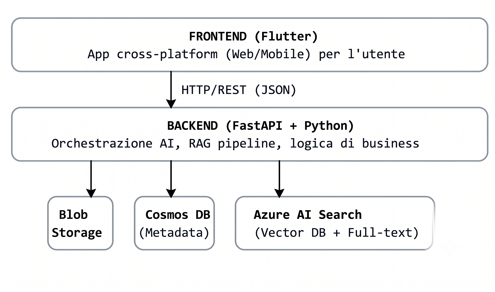

# Relazione di Progetto: Sistema RAG per l'Archiviazione e Ricerca di Notizie

## 1. Introduzione e Obiettivi

### 1.1 Contesto
Il presente documento descrive la progettazione e l'implementazione di un sistema cloud-native per la gestione di un archivio di notizie. In un contesto in cui il volume di informazioni cresce esponenzialmente, si rende necessario un sistema intelligente capace non solo di archiviare, ma anche di analizzare, indicizzare e ricercare contenuti testuali in modo efficiente.

### 1.2 Requisiti di traccia
Il sistema richiede la realizzazione di un'applicazione basata su piattaforma cloud in grado di gestire il caricamento di articoli testuali in formati standard (TXT, Markdown, JSON) e facoltativamente in formati complessi (DOCX, PDF). Una volta caricato, l'articolo necessita dell'estrazione del contenuto, della generazione automatica di metadati descrittivi e dell'indicizzazione per consentire sia ricerche tradizionali che interrogazioni in linguaggio naturale tramite l'integrazione di un sistema RAG (Retrieval-Augmented Generation). L'intera infrastruttura deve essere obbligatoriamente basata su Microsoft Azure.

### 1.3 Obiettivi del sistema
Gli obiettivi principali consistono nella realizzazione di un'architettura disaccoppiata (decoupled), scalabile e resiliente. Si mira a fornire un'interfaccia utente multipiattaforma accessibile, supportata da un backend robusto in grado di orchestrare pipeline di intelligenza artificiale avanzate per l'arricchimento semantico dei documenti e la successiva fase di retrieval.

## 2. Architettura del Sistema

### 2.1 Panoramica decoupled
L'architettura proposta prevede una netta separazione delle responsabilità attraverso un approccio a tre layer: Frontend, Backend e Servizi Cloud. Questa modularità garantisce la possibilità di evolvere, scalare e manutenere i singoli componenti in maniera indipendente, limitando l'accoppiamento architetturale.

### 2.2 Motivazioni dell'architettura multi-layer
Si è optato per un'architettura multi-layer per massimizzare la flessibilità del sistema. Il frontend, operando come client autonomo, comunica tramite protocollo HTTP/REST (JSON) con il backend, il quale funge da orchestratore centrale della logica di business e delle pipeline di intelligenza artificiale. I servizi Azure sottostanti operano come layer di persistenza e computazione specializzata, accessibili esclusivamente tramite le API del backend, garantendo un controllo centralizzato sulla sicurezza e sui flussi di dati.

## 3 Tecnologie e Strumenti

### 3.1 Servizi Azure

#### Azure Blob Storage
Per l'archiviazione dei file originali (TXT, MD, JSON, DOCX, PDF) si è scelto Azure Blob Storage. L'adozione di tale servizio è motivata dalla sua natura di standard de-facto per l'object storage in ambiente Azure, in grado di offrire scalabilità virtualmente illimitata, elevata affidabilità e un'integrazione nativa con gli altri strati cloud.

#### Azure Cosmos DB
La gestione dei metadati, sia manuali che auto-generati, è affidata ad Azure Cosmos DB (API NoSQL). Essendo lo schema degli articoli fortemente eterogeneo e variabile nel tempo, l'adozione di un database documentale JSON-native risulta strutturalmente superiore a un approccio relazionale rigido. L'utilizzo in modalità Serverless è stato scelto per ottimizzare i costi operativi e garantire una risposta prestazionale istantanea per query sui metadati.

#### Azure AI Search
Per l'indicizzazione vettoriale dei frammenti di testo (chunk) e la ricerca semantica è stato adottato Azure AI Search. Tale componente unisce funzionalità di ricerca vettoriale (tramite algoritmi HNSW) e di ricerca full-text tradizionale (Hybrid Search) all'interno di un unico servizio gestito, eliminando la necessità di orchestrare database vettoriali di terze parti e abbassando la complessità operativa.

#### Azure OpenAI Service
L'integrazione dei modelli linguistici per la generazione dei metadati e il motore RAG si basa su Azure OpenAI Service. Si è adottato tale servizio per garantire conformità, bassa latenza e un'integrazione nativa e sicura all'interno dell'ecosistema cloud Azure. I modelli selezionati, `text-embedding-ada-002` per gli embedding e `gpt-4o-mini` per le operazioni di natural language processing, rappresentano lo stato dell'arte in termini di compromesso tra capacità elaborativa ed efficienza.

#### Azure Bicep — Infrastructure as Code
Per il provisioning automatico e riproducibile delle risorse Azure si è adottato Azure Bicep come strumento nativo di Infrastructure as Code (IaC). Tale scelta, in netta contrapposizione alla configurazione manuale tramite portale web, è stata privilegiata anzitutto per motivi di sicurezza e controllo delle risorse: la gestione dichiarativa dell'infrastruttura azzera il rischio di errori umani (quali errate configurazioni di rete, dimenticanze sulle policy di cifratura o errate impostazioni sui livelli di accesso dei container) e consente di applicare rigorosi standard di sicurezza omogenei su tutte le risorse distribuite.

Dal punto di vista architetturale e metodologico, l'adozione di Azure Bicep garantisce:

Versionabilità e Tracciabilità: L'intera infrastruttura è trattata come codice sorgente e gestita direttamente all'interno della repository Git del progetto, permettendo di tracciare ogni modifica e mantenere uno storico completo delle evoluzioni architetturali.

Riproducibilità degli Ambienti: Consente di ricreare o scalare l'intero stack applicativo (dallo storage al database NoSQL, fino ai servizi di ricerca vettoriale) in modo del tutto identico e automatizzato, facilitando la gestione di ambienti separati di sviluppo, test e produzione.

Gestione Nativa dello Stato e Vantaggi Rispetto all'Approccio Manuale: Essendo lo strumento IaC nativo di Microsoft Azure, Bicep offre una sintassi dichiarativa fortemente semplificata rispetto ai tradizionali e complessi ARM template in formato JSON. Inoltre, a differenza di framework terzi (come Terraform), si integra nativamente con le API di Azure senza richiedere la gestione complessa e delicata di file di stato locali o remoti (.tfstate), allineando pienamente il progetto agli standard professionali e accademici più avanzati del settore.

### 3.2 FastAPI
Il layer backend è stato sviluppato in Python utilizzando il framework FastAPI. La scelta è ricaduta su tale tecnologia in virtù delle sue eccellenti prestazioni, del supporto nativo alla programmazione asincrona e dell'integrazione nativa con Pydantic per la validazione formale dei dati in ingresso, elementi cruciali per la realizzazione di API REST performanti in un sistema distribuito.

### 3.3 LangChain
Per l'orchestrazione delle pipeline di intelligenza artificiale si è optato per il framework LangChain. Rispetto alle alternative disponibili, LangChain offre una maggiore maturità e astrazione per la costruzione di catene RAG personalizzate, fornendo al contempo un'integrazione nativa ottimizzata con i servizi Azure OpenAI e Azure AI Search utilizzati.

### 3.4 Flutter/Dart
Il layer di presentazione (Frontend) è stato progettato utilizzando il framework Flutter (Dart). L'adozione di tale tecnologia consente di sviluppare un'applicazione client cross-platform a partire da un'unica base di codice, assicurando prestazioni native e un'interfaccia utente moderna e reattiva, requisiti essenziali per la fruizione ottimale dell'archivio notizie.

## 4. Dettagli Implementativi

### 4.1 Ingestion & Parsing
*(Da completare in seguito)*

### 4.2 Generazione metadati via LLM
*(Da completare in seguito)*

### 4.3 Chunking ed Embedding
*(Da completare in seguito)*

### 4.4 Motore RAG e risposta finale
*(Da completare in seguito)*

## 5. Trasparenza IA e Metodologia di Sviluppo

Il progetto è stato condotto secondo una metodologia "Review-driven development", prevedendo un'interazione iterativa con agenti basati su intelligenza artificiale generativa per la definizione architetturale e la generazione del codice sorgente.

### Revisione IaC Bicep, Commenti e README
Per la Componente IaC gestita tramite **Azure Bicep**, L'IAè stata guidata per eseguire le seguenti attività di refactoring e refinement:
1. **Verifica della correttezza sintattica e strutturale:** Revisione dei file `.bicep` per garantire la piena conformità con le specifiche e le API ufficiali di Microsoft Azure.
2. **Arricchimento della documentazione interna:** Inserimento di commenti esplicativi dettagliati all'interno degli script Bicep per rendere chiare le dipendenze tra risorse (es. associazione tra Storage Account, Cosmos DB Serverless e Azure AI Search).
3. **Ottimizzazione delle prestazioni e dei costi:** Validazione delle opzioni di ridondanza (Standard LRS per Blob Storage) e dei tier serverless (per Cosmos DB) per minimizzare il consumo dei crediti del profilo Azure for Students.
4. **Stesura della documentazione operativa:** Generazione del file `README.md` all'interno della cartella `azure/`, contenente le istruzioni dettagliate passo-passo per l'esecuzione dei comandi da Azure CLI (`az deployment group create`).

---
### 5.1 Registro delle Interazioni (Log degli Agenti AI)
| Feature / Task | Agente Utilizzato | Prompt Principale | Sintesi Risposta / Codice Generato |
|---|---|---|---|
| Revisione IaC Bicep, Commenti e README | Claude Sonnet 4.6 | "Agente, verifica la correttezza e l'ottimizzazione dei file Bicep per l'infrastruttura Azure. Aggiungi commenti esplicativi dettagliati all'interno del codice `.bicep` e genera il file `README.md` con le istruzioni per il deploy tramite Azure CLI." | Validazione degli script Bicep con inserimento di commenti esplicativi sulle singole risorse. Generazione del file `README.md` contenente i comandi `az login`, `az group create` e `az deployment` per il provisioning automatico dell'ambiente. |

## 6. Conclusioni e Sviluppi Futuri
*(Da completare a fine progetto)*
